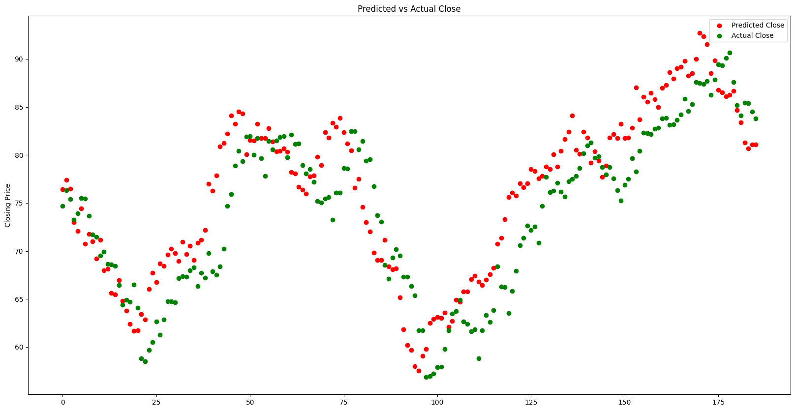
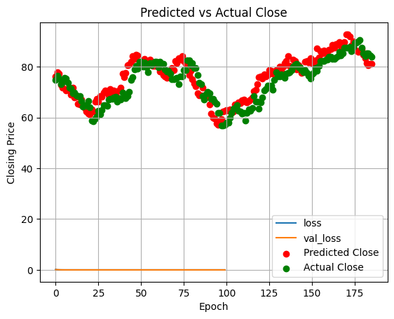

# Stock Price Prediction with LSTM and Sentiment Analysis

## Overview

This project aims to predict stock prices using an LSTM (Long Short-Term Memory) neural network, enhanced with sentiment analysis from financial news articles. The sentiment analysis is performed using the FinBERT model, which classifies news articles into positive, negative, and neutral sentiments. These sentiment scores, along with historical stock prices, are used as features to train the LSTM model.

## Features

- **Sentiment Analysis**: Utilizes FinBERT to analyze the sentiment of financial news articles.
- **LSTM Model**: Implements a deep learning model to predict stock prices based on historical data and sentiment scores.
- **Data Visualization**: Provides plots for training/validation loss and predicted vs. actual stock prices.
- **Evaluation Metrics**: Calculates Mean Absolute Error (MAE), Mean Squared Error (MSE), and Root Mean Squared Error (RMSE) to evaluate model performance.

## Requirements

- Python 3.7 or higher
- Required Libraries:
  - numpy
  - pandas
  - tqdm
  - matplotlib
  - tensorflow
  - torch
  - yfinance
  - holidays
  - scikit-learn
  - transformers

You can install the required libraries using pip:

```bash
pip install numpy pandas tqdm matplotlib tensorflow torch yfinance holidays scikit-learn transformers
```

## Data

- **Stock Data**: Historical stock price data is fetched using the `yfinance` library.
- **News Data**: The project assumes the presence of a CSV file (`dataset.csv`) containing news articles related to stocks. Ensure this file is correctly formatted and available in the project directory.

## Usage

1. **Data Preparation**:
   - Load and preprocess the news data from `analyst_ratings_processed.csv`.
   - Fetch historical stock price data for the desired ticker symbol (e.g., `BABA` for Alibaba).

2. **Sentiment Analysis**:
   - Analyze the sentiment of news articles using FinBERT.
   - Calculate average sentiment scores for each day.

3. **Model Training**:
   - Define and compile the LSTM model.
   - Train the model using the prepared dataset.
   - Evaluate the model's performance on a test set.

4. **Visualization**:
   - Plot training and validation loss over epochs.
   - Visualize predicted vs. actual stock prices.

## Results

### Without Sentiment Analysis



### With Sentiment Analysis



## Evaluation

The model's performance is evaluated using the following metrics:
- Mean Absolute Error (MAE)
- Mean Squared Error (MSE)
- Root Mean Squared Error (RMSE)

## Future Improvements

- **Hyperparameter Tuning**: Experiment with different hyperparameters to improve model performance.
- **Feature Engineering**: Incorporate additional features like trading volume, technical indicators, etc.
- **Model Complexity**: Explore different model architectures or add regularization techniques to prevent overfitting.

## Contributing

Contributions are welcome! Please open an issue or submit a pull request for any improvements or bug fixes.

## License

This project is licensed under the MIT License. 

